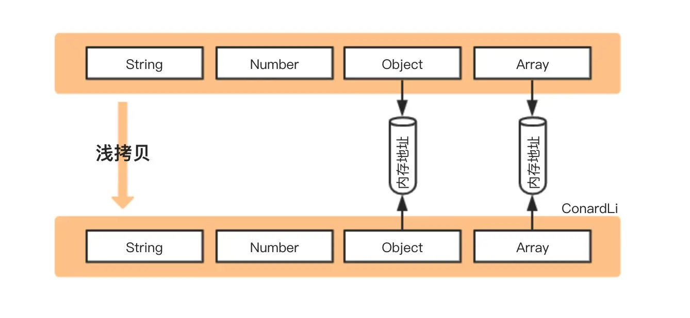
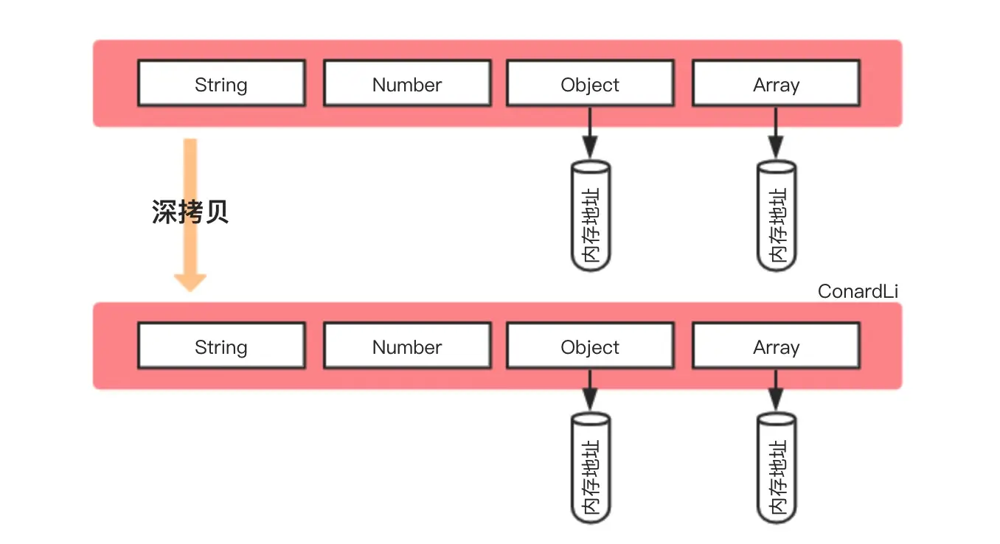
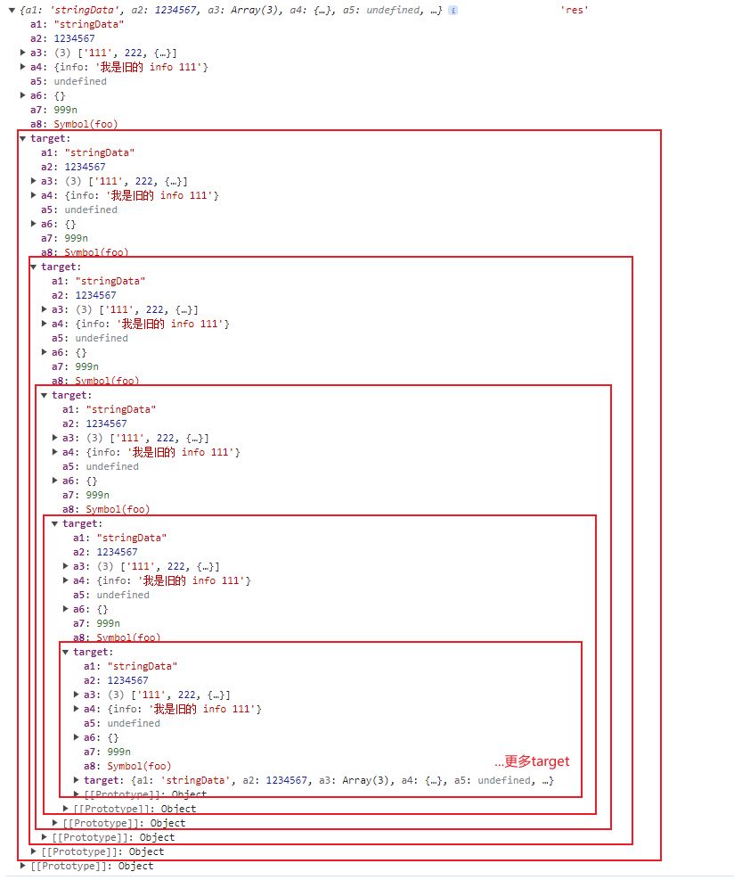
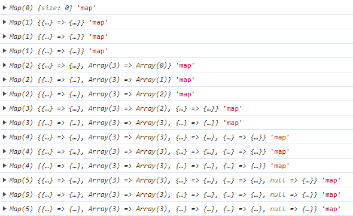
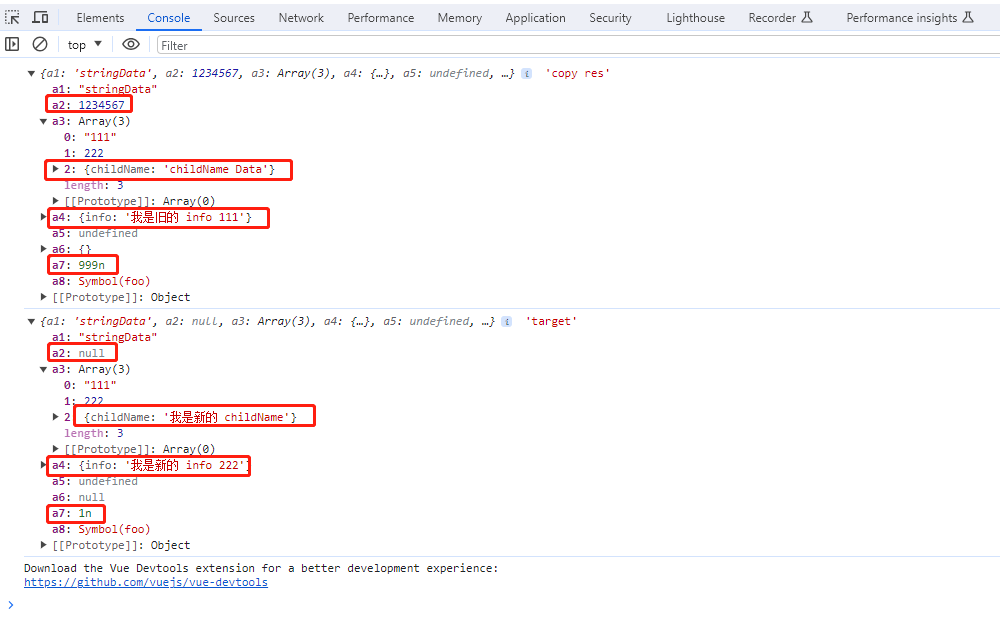

# 手写深拷贝

前言: 需要先了解 JS 的数据类型

## 一、浅拷贝、深拷贝区别

浅拷贝会创建一个新的对象，新对象有着与原始对象相同的属性值，如果

- 属性是基本类型，拷贝的就是基本类型的值
- 属性是引用类型，拷贝的就是内存地址（**原对象地址改变，新对象也会随之改变，新对象地址改变，也会影响原对象**）



深拷贝会创建一个新对象，拷贝原始对象的所有内容，新对象是在内存中开辟新区域，并不共用原始对象的对象地址

- 属性是基本类型，拷贝基本类型本身，并在内存中新开地址存储
- 属性是引用类型，拷贝引用类型本身，并在内存中新开地址存储（**原对象修改不会影响新对象，新对象修改也不会影响原对象**）



## 二、实践深拷贝

### （1）最简版本

```js
JSON.parse(JSON.stringify()); // 对无法序列化、引用类型、函数、循环引用的原对象无效
```

### （2）基础版本

#### 思路

- 如果原对象是基本类型，直接返回基本类型本身即可
- 如果原对象是引用类型，则创建新对象，并遍历原对象，并将其每个属性都执行深拷贝之后，依次添加到新对象

#### 实践

```js
// 测试数据 obj
let target = {
  a1: "stringData", // string
  a2: 1234567, // number
  a3: ["111", 222, { childName: "childName Data" }], // Array
  a4: {
    info: "我是旧的 info 111",
  }, // object
  a5: undefined, // undefined
  a6: null, // null
  a7: 999n, // BigInt
  a8: Symbol("foo"), // Symbol
};

// 深拷贝方法
function clone(target) {
  if (typeof target == "object") {
    let cloneTarget = Array.isArray(target) ? [] : {};
    for (const key in target) {
      cloneTarget[key] = clone(target[key]);
    }
    return cloneTarget;
  } else {
    return target;
  }
}

let res = clone(target); // 深拷贝
// let res = target; // 浅拷贝
target.a4.info = "我是新的 info 222";

console.log(res, "res"); // 采用深拷贝 target.info.detail 结果 我是旧的 info 111 ，不会因为原对象改变而改变
```

### （3）循环引用

```js
target.target = target; // 循环引用
let res = clone(target); // 直接调用基础版本的 clone 方法
console.log(res, "res"); // 结果 Uncaught RangeError: Maximum call stack size exceeded 直接溢出
```

> 问题原因：对象存在循环引用，也就是对象的属性引用了自身，所以我们需要新开辟存储空间解决这个问题

#### 思路

- 开辟新的存储空间，存储原对象和新对象的对应关系
- 拷贝对象前，先去存储空间中查找，是否已经拷贝过（来避免循环引用问题）
  - 有的话直接返回
  - 没有的话，继续拷贝

#### 实践

```js
/**
 * target 待拷贝的原对象
 * map 存储原对象与新对象的关系
 */
function clone(target, map = new Map()) {
  if (typeof target == "object") {
    let cloneTarget = Array.isArray(target) ? [] : {};
    // 存储空间中有，直接返回
    if (map.get(target)) {
      return map.get(target);
    }
    // 每个待拷贝对象都在 map 里面存一下
    map.set(target, cloneTarget);
    for (const key in target) {
      // 把 map 带上递归
      cloneTarget[key] = clone(target[key], map);
    }
    return cloneTarget;
  } else {
    return target;
  }
}
```



> function funcName(target, map = new Map())
> 这种写法表示， 第二个参数 map， 调用时有传入就用传入的，没有传入就新建一个空 map



### （4）多种数据类型

#### 思路

- 将数据分为 2 类，分别做不同的拷贝
  - 可以继续遍历的类型（如 object、array、Map 等等）
  - 不可以继续遍历的类型 （如 Boolean、Number、String、Date、Error 等）

1. 获取数据类型

Object.prototype.toString.call()：能判断所有原始数据类型，包括 **Error 对象，Date 对象** 等，更多数据类型判断方式见[1. 数据类型](./day9_数据类型.md)

```js
function getDataType(target) {
  return Object.prototype.toString.call(target).slice(8, -1); //Array,Object,Function,String,Null,Undefined,Number,Symbol
}
```

2. 分类进行拷贝

```js
function clone(target, map = new Map()) {
  if (typeof target !== "object") {
    return target;
  }
  if (map.get(target)) {
    return map.get(target);
  }

  let result = {};

  if (getDataType(target) === "Array") {
    result = [];
  }

  console.log(getDataType(target));
  // 防止循环引用
  map.set(target, result);

  for (const key in target) {
    // 保证 key 不是原型属性
    if (Object.hasOwn(target, key)) {
      result[key] = clone(target[key], map);
      console.log(result[key], " console.log(result[key])");
    }
  }

  return result;
}

let res = clone(target);

target.a2 = null;
target.a4.info = "我是新的 info 222";
target.a3[2].childName = "我是新的 childName";
target.a7 = 1n;

console.log(res, "copy res");
console.log(target, "target");
```



> hasOwnProperty 已经逐渐废弃，官方建议使用 Object.hasOwn()
> 原型属性（prototype 属性）
> 实例属性（自身属性）


## 三、参考文献

- https://juejin.cn/post/7061588533214969892
- https://juejin.cn/post/6844903929705136141
- https://developer.mozilla.org/zh-CN/docs/Web/JavaScript/Reference/Global_Objects/Object/hasOwn
- https://developer.mozilla.org/zh-CN/docs/Web/JavaScript/Inheritance_and_the_prototype_chain
