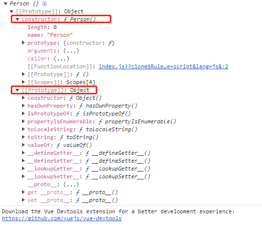

# 原型和原型链

## 最简原型链


```js
function Person()
let person1 = new Person();
console.log(person1)
```



## 原型链内部相等关系

### (1) 原型链内部相等关系图


### (2) 关系图归纳

所有相等关系，基于以下 2 条规则衍生

- **规则 1：原型对象（即 Person.prototype ）的 constructor 指向构造函数本身**
- **规则 2：实例（即 person1 ）的 **proto** 和 原型对象 指向同一个地方**

```js
Person.prototype.constructor == Person; // 规则1 结果 true
person1.__proto__ == Person.prototype; // 规则2 结果 true
```

### （3）对照关系图实践

#### 实例与原型
```js
function Foo() {}
let f1 = new Foo();
let f2 = new Foo();
f1.__proto__ == Foo.prototype; // 结果 true
f2.__proto__ == Foo.prototype; // 结果 true
```

1. Foo.prototype、Function.prototype 本质也是普通对象

```js
Foo.prototype.__proto__ == Object.prototype; // 结果 true 

 // 准则1
Foo.__proto__ = Function.prototype; // 准则2
Function.prototype.__proto__  == Object.prototype; //  准则2 (Function.prototype本质也是普通对象，可适用准则2)

```

2. 原型链在 Object.prototype.__proto__ 处终止

```js
Object.prototype.__proto__ == null; // // 结果 true 原型链到此停止
```

3. **注意 Foo 和 Function 的区别， Foo 是 Function 的实例**

```js
Foo == Function; // 结果 false, Foo 是 Function 的实例, 两者并不相等
Foo.constructor == Function; // 结果true
Foo.__proto__ == Function.prototype;  // 结果true
Foo.prototype.constructor == Foo; // 结果true
```

#### 原型的原型
以下待修改

```js
function Object()
let o1 = new  Object();
let o2 = new  Object();

o1.__proto__ == Object.prototype; // 结果 true
o2.__proto__ == Object.prototype; // 结果 true
```

```js


// 从中间 function Object()开始分析这一张经典之图
function Object()
let o1 = new  Object();
let o2 = new  Object();

o1.__proto__ = Object.prototype; // 准则2
o2.__proto__ = Object.prototype; // 准则2
Object.prototype.__proto__ = null; // 原型链到此停止
Object.prototype.constructor = Object; // 准则1
// 所有函数的__proto__  都和 Function.prototype指向同一个地方
Object.__proto__ = Function.prototype // 准则2 (Object本质也是函数)；
// 此处有点绕
Function.prototype.__proto__ =  Object.prototype; // 准则2 (Function.prototype本质也是普通对象，可适用准则2)
Object.prototype.__proto__ = null; // 原型链到此停止

// 从下方 function Function()开始分析这一张经典之图
function Function()
Function.__proto__ = Function.prototype // 准则2
Function.prototype.constructor = Function; // 准则1


```
