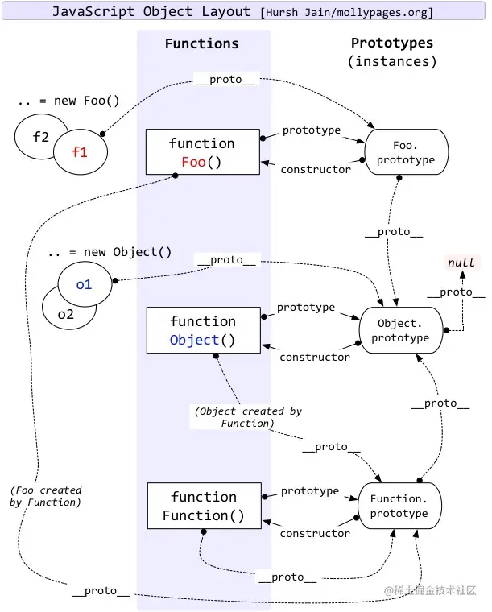

# 原型和原型链

## 一、最简原型链


```js
function Person()
let person1 = new Person();
console.log(person1)
```


- js 分为函数对象和普通对象，每个对象都有 `__proto__` 属性，但只有函数对象有 `prototype`

  - 普通对象：除了函数对象外的所有对象，不可以被调用
  - 函数对象：具有属性和方法、可以被调用、还有 call 属性

- `Object、Function、Array、Date、Boolean、Number、String、RegExp` 都是 js 内置函数

## 二、原型链内部相等关系

### (1) 原型链内部相等关系图



### (2) 关系图归纳

所有相等关系，基于以下 2 条规则衍生

- **规则 1：原型对象（即 `Person.prototype` ）的 `constructor` 指向构造函数本身**
- **规则 2：实例（即 `person1` ）的 `__proto__` 和 原型对象 指向同一个地方**

```js
Person.prototype.constructor == Person; // 规则1 结果 true
person1.__proto__ == Person.prototype; // 规则2 结果 true
```

### （3）对照关系图实践

```js
function Foo() {}
let f1 = new Foo();
let f2 = new Foo();
let o1 = new  Object();
let o2 = new  Object();
```

#### 从图上部的 function Foo() 开始分析

```js
f1.__proto__ == Foo.prototype; // 结果 true
f2.__proto__ == Foo.prototype; // 结果 true
```

1. Foo.prototype、Function.prototype 本质也是普通对象

```js
Foo.prototype.__proto__ == Object.prototype; // 结果 true

// 规则1
Foo.__proto__ = Function.prototype; // 规则2
Function.prototype.__proto__ == Object.prototype; //  规则2 (Function.prototype本质也是普通对象，可适用规则2)
```

2. 原型链在 Object.prototype.**proto** 处终止

```js
Object.prototype.__proto__ == null; // // 结果 true 原型链到此停止
```

3. **注意 Foo 和 Function 的区别， Foo 是 Function 的实例**

```js
Foo == Function; // 结果 false, Foo 是 Function 的实例, 两者并不相等
Foo.constructor == Function; // 结果true
Foo.__proto__ == Function.prototype; // 结果true
Foo.prototype.constructor == Foo; // 结果true
```

#### 从图中部的 function Object() 开始分析

```js
o1.__proto__ == Object.prototype; // 结果 true
o2.__proto__ == Object.prototype; // 结果 true
Object.prototype.__proto__ == null; // 结果 true, 原型链到此停止
Object.prototype.constructor == Object; // 结果 true, 规则1
Object.__proto__ == Function.prototype; // 结果 true, Object本质也是函数
Function.prototype.__proto__ == Object.prototype; // 结果 true, 规则2 (Function.prototype本质也是普通对象，可适用准则2)
```

#### 从图下部的 function Function() 开始分析

```js
console.log(Function.__proto__ == Function.prototype); // 结果 true, 规则2
console.log(Function.prototype.constructor == Function); // 结果 true, 规则1
```

## 三、参考文件

- https://github.com/mqyqingfeng/blog/issues/2
- https://juejin.cn/post/6844903989088092174
- https://juejin.cn/s/js%E5%87%BD%E6%95%B0%E5%AF%B9%E8%B1%A1%E5%92%8C%E6%99%AE%E9%80%9A%E5%AF%B9%E8%B1%A1
- https://developer.mozilla.org/zh-CN/docs/Web/JavaScript/Guide/Regular_expressions
