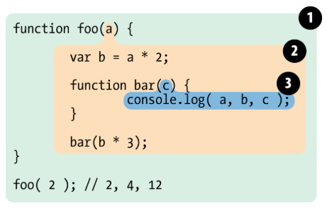

# 作用域与作用域链

## 一、什么是作用域

作用域就是一个独立的代码区域，域内的变量不会暴露到外部，外部无法访问，也就是说具有隔离性。

```js
function outFun() {
  var inVariable = "内层变量2";
}
outFun();
//  inVariable 的作用域仅在函数outFun内，外部无法访问
console.log(inVariable); // 结果 Uncaught ReferenceError: inVariable is not defined
```

JavaScript 使用词法作用域，也就说定义时就已经决定了作用域范围

> JavaScript uses lexical scoping. This means that functions are executed using the variable scope that was in effect when they were defined, not the variable scope that is in effect when they are invoked.
>
> JavaScript 使用词法作用域。 这意味着函数是使用定义时有效的变量范围来执行的，而不是调用它们时有效的变量范围。

## 二、作用域类型及效果

js 具有以下 3 类作用域

- 全局作用域
- 函数作用域
- 块级作用域（ES6 之后才有的）

### 全局作用域

全局作用域就表示可以在代码任何地方访问到，以下几种情况均会产生全局作用域

- 最外层函数
- 最外层函数外面定义的变量
- 未定义直接赋值的变量
- 所有 windowns 对象的属性

**最外层函数 和 最外层函数外面定义的变量**

```js
//最外层变量
var outVariable = "out variable";

//最外层函数
function outFun() {
  //内层变量
  var inVariable = "inner variable";

  //内层函数
  function innerFun() {
    console.log(inVariable);
  }
  innerFun();
}

// 最外层函数外的变量，作用域是全局，可以直接访问
console.log(outVariable); // 结果 out variable

// 最外层函数作用域是全局，可以直接访问
outFun(); // 结果 inner variable

// 局部变量，作用域仅在 outFun 函数内部，外部不可以访问
console.log(inVariable); //inVariable is not defined

// 内部函数， 作用域仅在 outFun 函数内部，外部不可以访问
innerFun(); //innerFun is not defined
```

**未定义直接赋值的变量**

```js
function outFun() {
  undefVariable = "undefined variable";
}

outFun();
// 未定义直接赋值的变量，作用域是全局，可以直接访问
console.log(undefVariable); // 结果 undefined variable
```

**所有 windowns 对象的属性**

例如 window.name、window.location、window.top 等等，更多 windowns 属性见 [MDN Window](https://developer.mozilla.org/zh-CN/docs/Web/API/Window)

### 函数作用域

在函数内部声明的变量，作用域是该函数内

**作用域分层：内层作用域，可以访问外层作用域的变量，外层作用域不可以访问内层作用域**

```js
function foo(a) {
  var b = a * 2;
  function bar(c) {
    console.log(a, b, c);
  }
  bar(b * 3);
}
foo(2); // 结果 2 4 12
```



如上例子，共有 3 层作用域

- 1 绿色部分是全局作用域（最外层函数产生全局作用域），该作用域拥有一个函数 foo
- 2 黄色部分作用域是 foo 函数内部，该作用域拥有一个自定义的变量 b , 一个外部传入的变量 a , 一个函数 bar
- 3 蓝色部分作用域是 bar 函数内部，该作用域有一个外部传入的变量 c

**块语句（大括号“{}”中间的语句）不会创建新的作用域， 比如 if 语句、swtich 语句、for 循环语句、while 循环语句**

```js
// if 语句不会创建作用域，
if (true) {
  var a = 12; // a 属于最外层函数外定义的变量，所以在全局作用域中
}
```

### 块级作用域

ES6 之后，js 支持块级作用域，块级作用域内部的变量只能在指定块内部访问

**如何产生块级作用域**

- 使用 let 声明变量
- 使用 const 声明变量

**块级作用域范围**

- 一个函数内部
- 一个代码块（即一对大括号“{}”）内部

**let/const 声明不会被提升到当前代码块顶部**

```js
function test(status) {
  if (status) {
    // console.log(res) // 结果 Cannot access 'res' before initialization，即 res 在此处还没定义不可访问
    let res = "blue";
    // console.log(res); // 结果 blue res 在此处可用
  } else {
    // console.log(res) // 结果 res is not defined，即 res 在此处无法访问
  }
  // console.log(res); // 结果 res is not defined，即 res 在此处无法访问
}
test(true); // 尝试传递 true 以及 false 分别试试
```

**禁止重复声明**

同一作用域下，不能重复声明一个已有的标识符

```js
let name = "hohina";
var name = "yoko"; // 报错 Uncaught SyntaxError: Identifier 'name' has already been declared
```

**for 循环中 let 声明的 i 每一轮都是新的 i**

使用 let 声明的 i ，仅在块级作用域内有效，最后输出的是 6

```js
var arr = [];
for (let i = 0; i < 10; i++) {
  arr[i] = function() {
    console.log(i);
    return i
  }
}
arr[6](); // 结果 6
```

使用 var 声明的 i ，在全局作用域内有效，最后输出的是 10

```js
var arr = [];
for (var i = 0; i < 10; i++) {
  arr[i] = function() {
    console.log(i);
    return i
  }
}
arr[6](); // 结果 10
```

> Q: 每一轮循环变量的 i 都是重新声明的，那么怎么知道上一轮循环的值，从而计算当前的值
> A: js引擎内部会记住上一轮的值，然后在上一轮的基础上进行初始化

**for 循环中的 循环变量 i 与 内部变量i 不在同一个作用域**

- 循环变量 i 在父作用域
- 内部变量 i 在子作用域

```js
for (let i = 0; i < 3; i++) {
  let i = "sass"
  console.log(i); // 结果 输出 3 遍 sass
}
```

**父子作用域存在同名变量不会报错，但子作用域优先级高于父优先级，父作用域的同名变量将不再可以显式访问**

```js
for (let i = 0; i < 3; i++) {
  console.log(i); // 报错 Cannot access 'i' before initialization
  let i = "sass"
  console.log(i);
}
```

```js
for (let i = 0; i < 3; i++) {
  console.log(i); // 结果 0 1 2
}
```

```js
for (let i = 0; i < 3; i++) {
  console.log(i); // 0 1 2
  let o = "sass"
  console.log(o); // 结果 输出 3 遍 sass
}
```

## 参考文献

- https://github.com/mqyqingfeng/Blog/issues/3
- https://juejin.cn/post/6844903797135769614
- https://developer.mozilla.org/zh-CN/docs/Web/API/Window
