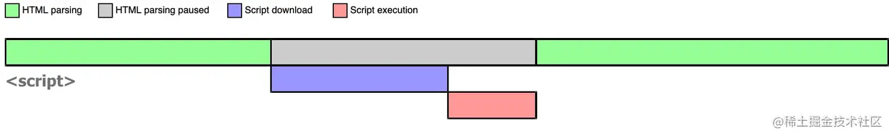
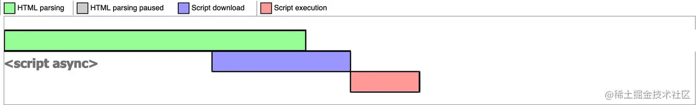

# script 标签中 defer 和 async 的区别？

### 1. defer 和 async 属性都没有

没有任何属性的 script 标签，就会暂停解析，先发送网络请求获取该 JS 脚本的代码内容，然后让 JS 引擎执行该代码，当代码执行完毕后恢复解析。

```js
<script src="script.js"></script>
```



### 2. async script

async 表示异步，开始时不会阻塞浏览器解析 HTML，一旦网络请求回来之后，**如果此时 HTML 还没有解析完**，浏览器会暂停解析（此时会阻塞解析），**先让 JS 引擎执行代码，执行完毕后再进行解析**

```js
<script async src="script.js"></script>
```


当然，如果在 JS 脚本请求回来之前，HTML 已经解析完毕了（一直不阻塞），那就啥事没有，立即执行 JS 代码



所以**async 是不可控的**，因为执行时间不确定，你如果在异步 JS 脚本中获取某个 DOM 元素，有可能获取到也有可能获取不到。而且如果存在多个 async 的时候，它们之间的执行顺序也不确定，**完全依赖于网络传输结果，谁先到执行谁。**

### 3. defer script

defer 表示延迟，不会阻塞浏览器解析 HTML，一旦网络请求回来之后，**如果此时 HTML 还没有解析完**，浏览器不会暂停解析并执行 JS 代码，而是**等待 HTML 解析完毕再执行 JS 代码**

```js
<script defer src="script.js"></script>
```


所以，如果存在多个 defer script 标签，浏览器（IE9 及以下除外）会保证它们**按照在 HTML 中出现的顺序执行，不会破坏 JS 脚本之间的依赖关系。**

### 4. defer 和 async 属性同时有，等价于只有 async

```js
<script defer async src="script.js"></script>
```

### 5. script 标签中 defer 和 async 属性小结


