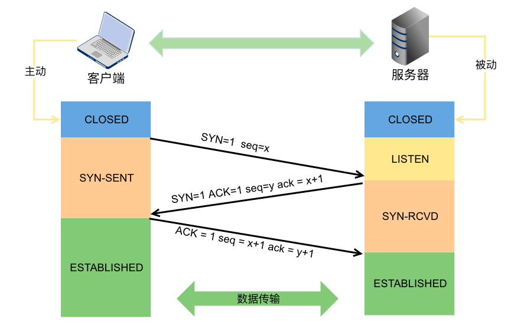

# 从浏览器地址栏输入 url 到请求返回发生了什么？

## 1. 过程列表：

> 1. DNS 解析：将域名解析为 ip 地址
> 2. TCP 连接： TCP 三次握手
> 3. 发送 HTTP 请求
> 4. 服务器处理并返回 HTTP 报文
> 5. 浏览器解析并渲染画面
> 6. 断开连接：TCP 四次挥手

## 2. URL 的结构

```shell
scheme://host.domain:port/path/filename?abc=123#456789 # 示例
```

> scheme - 定义因特网服务的类型。常见的协议有 http、https、ftp、file，https 表示进行加密的网络传输。
> host - 定义域主机（http 的默认主机是 www）
> domain - 定义因特网域名，比如 baidu.com
> port - 定义主机上的端口号（http 的默认端口号是 80）
> path - 定义服务器上的路径（如果省略，则文档必须位于网站的根目录中）。
> filename - 定义文档/资源的名称
> query - 即查询参数
> fragment - 即 # 后的 hash 值，一般用来定位到某个位置

## 3. DNS 域名解析

浏览器不能直接通过域名找到服务器，需要把域名解析为 ip 地址

### 什么是域名解析？

DNS 是一个网络服务器，我们的域名解析简单来说就是在 DNS 上记录一条信息记录。DNS 协议提供通过域名查找 IP 地址，或逆向从 IP 地址反查域名的服务。

### 浏览器如何通过域名去查询 URL 对应的 IP ？

DNS 域名解析分为：递归查询，迭代查询两种，现一般为迭代查询。

浏览器 --> 本地域名服务器 --> 根域名服务器 --> COM 顶级域名服务器 --> 主域名服务器


## 4. DNS 的优化与应用

### 4.1 DNS 缓存

DNS 具有多级缓存（与浏览器距离从近到远排序如下）:

- 浏览器缓存
- 系统缓存
- 路由器缓存
- IPS 服务器缓存
- 根域名服务器缓存
- 顶级域名服务器缓存
- 主域名服务器缓存。

### 4.2 DNS 负载均衡

DNS 负载均衡技术（DNS 重定向）的实现原理是：在 DNS 服务器中为**同一个主机名配置多个 IP 地址**，在应答 DNS 查询时， DNS 服务器对每个查询将以 DNS 文件中主机记录的 IP 地址按顺序返回不同的解析结果，**将客户端的访问引导到不同的机器上**去，使得不同的客户端访问不同的服务器，从而达到负载均衡的目的。

所谓的 CDN 利用 DNS 服务器返回一个跟用户最接近的点的 IP 地址给用户，CDN 节点的服务器负责响应用户的请求，提供所需的内容。达到加速效果

DNS Prefetch 是一种 DNS 预解析技术。浏览网页时，浏览器会在加载网页时对网页中的域名进行解析缓存，这样在你单击当前网页中的连接时就无需进行 DNS 的解析，减少用户等待时间。

### 4.3 OSI、TCP/IP 模型

OSI : 物数网传会表应
TCP/IP： 网网传应


### 4.4 TCP 三次握手

- 客户端发送一个带 SYN=1，Seq=X 的数据包到服务器端口（第一次握手，由浏览器发起，告诉服务器我要发送请求了）

- 服务器发回一个带 SYN=1， ACK=X+1， Seq=Y 的响应包以示传达确认信息（第二次握手，由服务器发起，告诉浏览器我准备接受了）

- 客户端再回传一个带 ACK=Y+1， Seq=Z 的数据包，代表“握手结束”（第三次握手，由浏览器发送，告诉服务器，我马上就发了，准备接受吧）

TCP 三次握手结束后，开始发送 HTTP 请求报文



### 4.5 服务器处理请求并返回 HTTP 报文

每台服务器上都会安装处理请求的应用——Web server。常见的 web server 产品有 apache、nginx、IIS、Lighttpd 等


### 4.6 浏览器解析渲染页面

**4.6.1 渲染流程**

**用户界面(User Interface)** － 包括地址栏、后退/前进按钮、书签目录等，也就是你所看到的除了用来显示你所请求页面的主窗口之外的其他部分

**浏览器引擎(Browser Engine)** － 用来查询及操作渲染引擎的接口

**渲染引擎(Rendering Engine)** － 用来显示请求的内容，例如，如果请求内容为 html，它负责解析 html 及 css，并将解析后的结果显示出来

**网络(Networking)** － 用来完成网络调用，例如 http 请求，它具有平台无关的接口，可以在不同平台上工作

**JS 解释器(JS Interpreter)** － 用来解释执行 JS 代码

**UI 后端(UI Backend)** － 用来绘制类似组合选择框及对话框等基本组件，具有不特定于某个平台的通用接口，底层使用操作系统的用户接口

**数据存储(DB Persistence)** － 属于持久层，浏览器需要在硬盘中保存类似 cookie 的各种数据，HTML5 定义了 web database 技术，这是一种轻量级完整的客户端存储技术


**4.6.2 多进程的浏览器**

一个主控进程，以及每一个 tab 页面都会新开一个进程（某些情况下多个 tab 会合并进程）进程可能包括主控进程，插件进程， GPU ，tab 页（浏览器内核）等等

- Browser 进程：浏览器的主进程（负责协调、主控），只有一个
- 第三方插件进程：每种类型的插件对应一个进程，仅当使用该插件时才创建
- GPU 进程：最多一个，用于 3D 绘制
- 浏览器渲染进程（内核）：默认每个 Tab 页面一个进程，互不影响，控制页面渲染，脚本执行，事件处理等（有时候会优化，如多个空白 tab 会合并成一个进程）

**4.6.3 多线程的浏览器内核**

每一个 tab 页面可以看作是浏览器内核进程，然后这个进程是多线程的，它有几大类子线程：

- GUI 线程
- JS 引擎线程
- 事件触发线程
- 定时器线程
- 网络请求线程

**4.6.4 浏览器内核拿到内容后，渲染步骤**

**整体步骤：**

1. 解析 HTML，构建 DOM 树

2. 解析 CSS，生成 CSS 规则树

3. 合并 DOM 树和 CSS 规则，生成 render 树

4. 布局 render 树（Layout/reflow），负责各元素尺寸、位置的计算

5. 绘制 render 树（paint），绘制页面像素信息


**详细步骤：**

**4.6.1 HTML 解析，构建 DOM**

> Bytes → characters → tokens → nodes → DOM

- Conversion 转换：浏览器将获得的 HTML 内容（Bytes）基于他的编码转换为单个字符

- Tokenizing 分词：浏览器按照 HTML 规范标准将这些字符转换为不同的标记 token。每个 token 都有自己独特的含义以及规则集

- Lexing 词法分析：分词的结果是得到一堆的 token，此时把他们转换为对象，这些对象分别定义他们的属性和规则

- DOM 构建：因为 HTML 标记定义的就是不同标签之间的关系，这个关系就像是一个树形结构一样
  例如：body 对象的父节点就是 HTML 对象，然后段略 p 对象的父节点就是 body 对象


**4.6.2 解析 CSS，生成 CSS 规则树**

> Bytes → characters → tokens → nodes → CSSOM

与 HTML 解析类似，所以从 Bytes 到 nodes 下图中不再重复


**4.6.3 合并 DOM 树和 CSS 规则，生成 render 树**

当 DOM 树和 CSSOM 都有了后，就要开始构建渲染树了（renderTree），一般来说，渲染树和 DOM 树相对应的，但不是严格意义上的一一对应,因为有一些不可见的 DOM 元素不会插入到渲染树中，如 head 这种不可见的标签或者 display: none 等


**4.6.4 布局 render 树（Layout/Reflow），负责各元素尺寸、位置的计算**

布局：通过渲染树中渲染对象的信息，计算出每一个渲染对象的位置和尺寸。

**4.6.5 绘制 render 树（Paint），绘制页面像素信息**

绘制阶段，系统会遍历呈现树，并调用呈现器的“paint”方法，将呈现器的内容显示在屏幕上。。


```shell
5.1 计算CSS样式 # compute style

5.2 构建渲染树 # construct frames

5.3 布局，主要定位坐标和大小，是否换行，各种 position overflow z-index 属性 # layout

5.4 绘制，将图像绘制出来 # paint

```

### 4.6.7 断开连接

当数据传送完毕，需要断开 tcp 连接，此时发起 tcp 四次挥手。

- 浏 ---> 服，**Fin、Ack、Seq，表示已经没有数据传输**了。并**浏览器进入 FIN_WAIT_1 状态**。

(第一次挥手：由浏览器发起的，发送给服务器，我请求报文发送完了，你准备关闭吧)

- 服 ---> 浏，**Ack、Seq，表示同意关闭请求**。此时**浏览器进入 FIN_WAIT_2 状态**。

(第二次挥手：由服务器发起的，告诉浏览器，我请求报文接受完了，我准备关闭了，你也准备吧)

- 服 ---> 浏，**Fin、Ack、Seq，请求关闭连接**。并**服务器进入 LAST_ACK 状态**。

(第三次挥手：由服务器发起，告诉浏览器，我响应报文发送完了，你准备关闭吧)

- 浏 ---> 服，**Ack、Seq**。然后**浏览器进入等待 TIME_WAIT 状态**。服务器收到浏览器的报文段以后关闭连接。发起方等待一定时间未收到回复，则正常关闭。

(第四次挥手：由浏览器发起，告诉服务器，我响应报文接受完了，我准备关闭了，你也准备吧)

