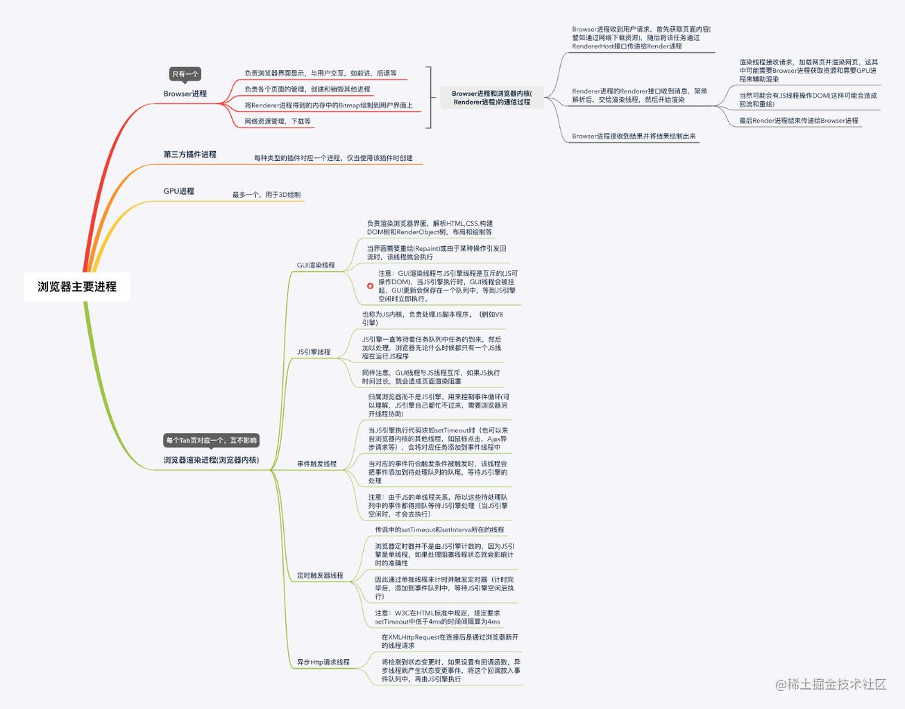
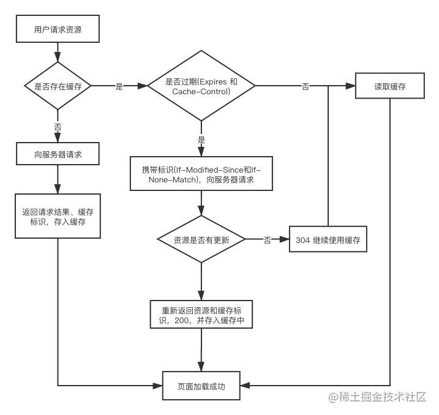
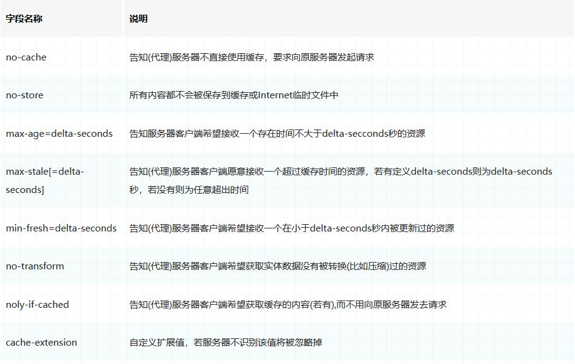
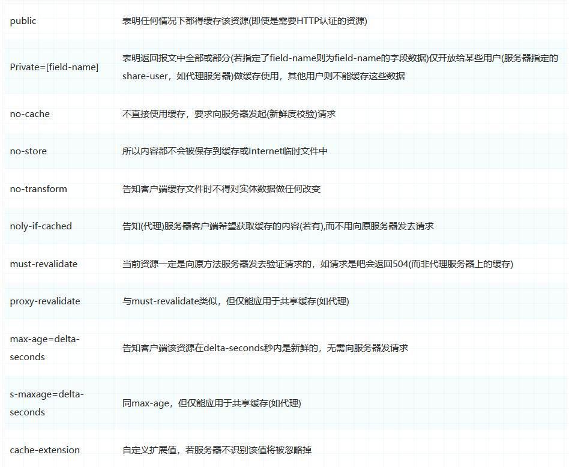
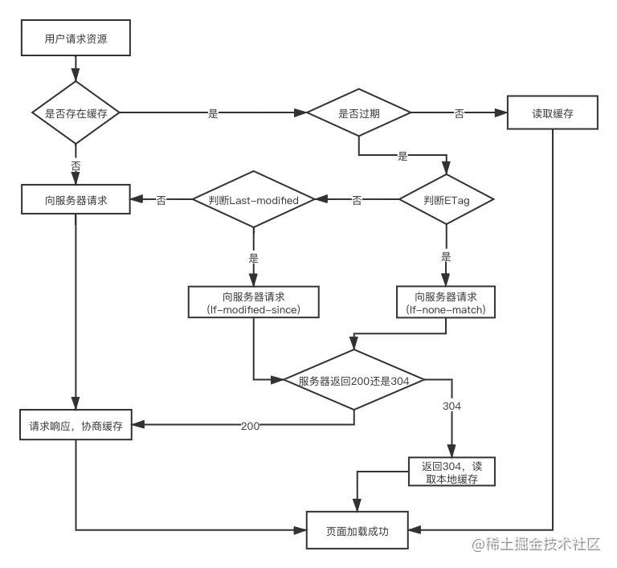
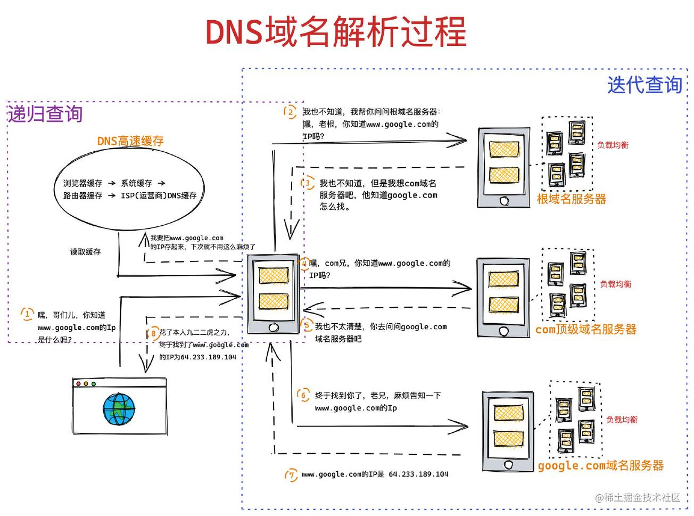
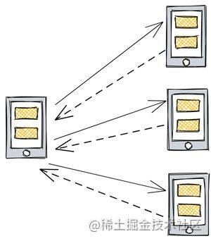
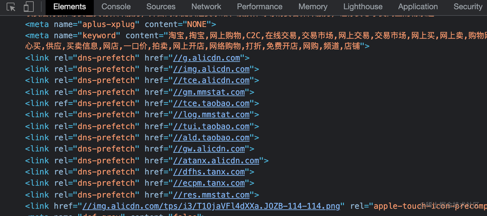
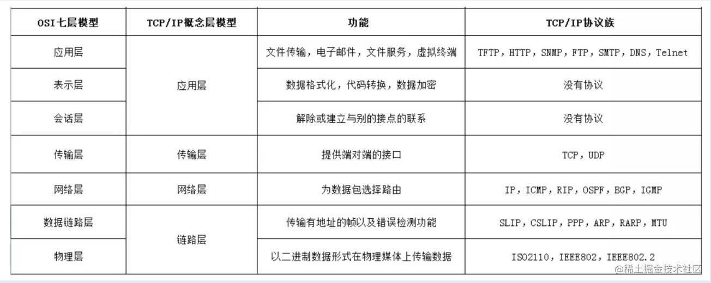
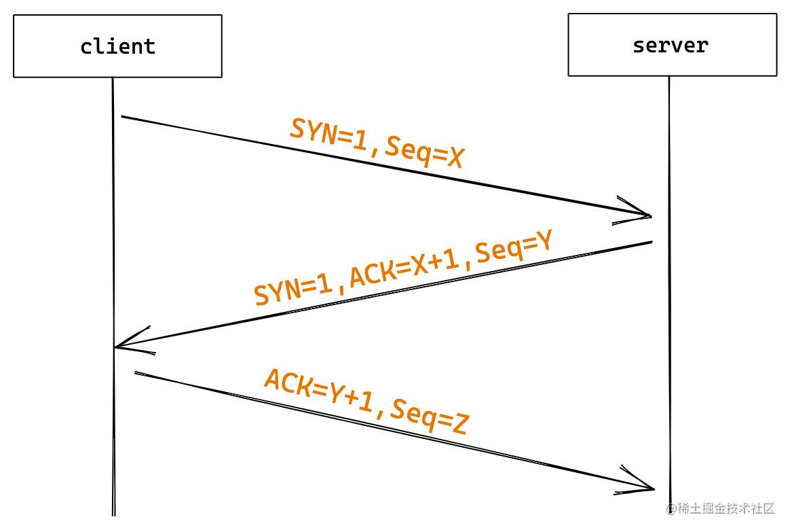

# 从输入 URL 开始建立前端知识体系

## 前言：浏览器主要进程

- 浏览器主进程：只有一个，主要控制页面的创建、销毁、网络资源管理、下载等。
- 第三方插件进程：每一种类型的插件对应一个进程，仅当使用该插件时才创建。
- GPU 进程：最多一个，用于 3D 绘制等。
- 浏览器渲染进程(浏览器内核)：每个 Tab 页对应一个进程，互不影响。

## 1. 输入网址并解析

### 1.1 url 组成

URL 主要由 协议、主机、端口、路径、查询参数、锚点 6 部分组成

### 1.2 url 解析

输入 URL 后，浏览器会解析出协议、主机、端口、路径等信息，并构造一个 HTTP 请求。

优先级从高到低：**强缓存策略(从缓存拿) --> 协商缓存(从缓存拿) --> 发起请求(从服务器拿)**

- 1. 浏览器发送请求前，根据请求头的 `expires` 和 `cache-control` 判断是否命中（包括是否过期）**强缓存策略**，如果命中，**直接从缓存获取资源**，并不会发送请求。如果没有命中，则进入下一步。

- 2. 没有命中强缓存规则，浏览器会发送请求，根据请求头的 `If-Modified-Since` 和 `If-None-Match` 判断是否命中**协商缓存**，如果命中，**直接从缓存获取资源**。如果没有命中，则进入下一步。

- 3. 如果**前两步都没有命中**，则**直接从服务端获取资源。**

**关于 HSTS**, 由于安全隐患，会使用 HSTS 强制客户端使用 HTTPS 访问页面。 当你的网站均采用 HTTPS，并符合它的安全规范，就可以申请加入 HSTS 列表，之后用户不加 HTTPS 协议再去访问你的网站，浏览器都会定向到 HTTPS。无论匹配到没有，都要开始 DNS 查询工作了。

### 1.3 浏览器缓存

#### 强缓存

向**浏览器缓存**查找该请求结果，并根据该结果的**缓存规则**来决定**是否使用该缓存结果**的过程。

强缓存分为 2 类：Expires 和 Cache-Control

**强缓存中的 Expires**

- 版本：HTTP/1.0
- 来源：存在于服务端返回的响应头中
- 语法：Expires: Wed, 22 Nov 2019 08:41:00 GMT
- 缺点：服务器的时间和浏览器的时间可能并不一致导致失效

**强缓存中的 Cache-Control**

- 版本：HTTP/1.1
- 来源：响应头和请求头
- 语法：Cache-Control:max-age=3600
- 缺点：时间最终还是会失效

**请求头各项字段**

**响应头各项字段**

#### 协商缓存

在强制缓存失效后，浏览器携带缓存标识向服务器发起请求，由**服务器根据缓存标识**决定**是否使用缓存**的过程

**流程图解读：**

1. 在浏览器第一次给服务器发送请求后，服务器会在响应头中加上 `Last-Modified` 字段。

2. 浏览器接收到后，如果再次请求，会在请求头中携带 `If-Modified-Since` 字段，这个字段的值也就是服务器传来的**最后修改时间**。

3. 服务器拿到请求头中的 `If-Modified-Since` 的字段后，其实会和这个服务器中该资源的最后修改时间 `Last-Modified` 对比,询问服务器在该日期后资源**是否有更新**，有更新的话就会将新的资源发送回来。

4. 但是如果**在本地打开缓存文件**，就会造成 `Last-Modified` 被修改，在 HTTP / 1.1 **出现 `ETag`。**

> 什么是 `ETag` ?
>
> `ETag` 是服务器根据当前文件的内容，给文件生成的唯一标识，只要里面的内容有改动，这个值就会变。
> 服务器通过响应头把 `ETag` 给浏览器。浏览器接收到 `ETag` 的值, 会在下次请求时
> 将 `ETag` 的值作为 `If-None-Match` 这个字段的内容，并放到请求头中，然后发给服务器。

当下面2种方式都存在的时候，服务器会优先考虑 ETag

- Last-Modified(响应头)，If-Modified-Since(请求头) 
- ETag(响应头)、If-None-Match(请求头)

#### 存储位置

缓存存储位置分为：

- Service Worker
- Memory Cache
- Disk Cache
- Push Cache

**使用 Service Worker 缓存**

Service Worker 是运行在浏览器背后的独立线程，一般可以用来实现缓存功能。**使用 Service Worker** 的话，**传输协议必须为 HTTPS**。因为 Service Worker 中涉及到请求拦截，所以必须使用 HTTPS 协议来保障安全。

Service Worker 的缓存与浏览器其他内建的缓存机制不同，它可以让我们自由控制缓存哪些文件、如何匹配缓存、如何读取缓存，并且 **Service Worker 的缓存是持续性的。**

Service Worker 实现缓存功能一般分为三个步骤：
- 1. 注册 Service Worker
- 2. 监听到 install 事件以后就可以缓存需要的文件，
- 3. 在下次用户访问的时候，通过拦截请求的方式查询是否存在缓存（存在就直接读取缓存，不存在就请求数据）

当 Service Worker 没有命中缓存的时候，我们需要去调用 fetch 函数获取数据。也就是说，**如果我们没有在 Service Worker 命中缓存的话，会根据缓存查找优先级去查找数据**。但是不管我们是从 Memory Cache 中还是从网络请求中获取的数据，浏览器都会显示我们是从 Service Worker 中获取的内容。

**使用 Memory Cache 缓存**

Memory Cache 也就是**内存中的缓存**，主要包含的是当前中页面中已经抓取到的资源,例如页面上已经下载的样式、脚本、图片等。读取内存中的数据肯定比磁盘快,内存缓存虽然读取高效，可是缓存持续性很短，会**随着进程的释放而释放**。 一旦我们关闭Tab页面，内存中的缓存也就被释放了。

> ps：
> 内存缓存在缓存资源时并不关心返回资源的 HTTP 缓存头 `Cache-Control` 是什么值
> 同时资源的匹配也并非仅仅是对URL做匹配，还可能会对 `Content-Type` ， `CORS` 等其他特征做校验。

**使用 Disk Cache 缓存**

Disk Cache 也就是存储在**硬盘中的缓存**，读取速度慢点，但是什么都能存储到磁盘中，比之 Memory Cache 胜在容量和存储时效性上。

**使用 Push Cache 缓存**

Push Cache（**推送缓存**）是 HTTP/2 中的内容，出现的条件苛刻

- 当上面三种缓存都没有命中时，它才会被使用。
- 只在会话（Session）中存在，一旦会话结束就被释放，并且缓存时间也很短暂
- 同时它也并非严格执行HTTP头中的缓存指令。

Push Cache 特点：
- 1. 所有的资源都能被推送，并且能够被缓存,但是 Edge 和 Safari 浏览器支持相对比较差
- 2. 可以推送 no-cache 和 no-store 的资源
- 3. 一旦连接被关闭，Push Cache 就被释放
- 4. 多个页面可以使用同一个HTTP/2的连接，也就可以使用同一个Push Cache。
- 5. Push Cache 中的缓存只能被使用一次
- 6. 浏览器可以拒绝接受已经存在的资源推送
- 7. 可以给其他域名推送资源

### 1.4 DNS 域名解析

发起 http 请求之前， 浏览器先要去获得想要访问的网页的ip地址，所以会先发一个 UDP 包给 DNS 域名解析服务器

#### 递归查询(查缓存)

> 浏览器缓存 --> 系统缓存 --> 路由器缓存 --> ISP(运营商)DNS缓存

#### 迭代查询(向上一级问)

局部的DNS服务器并不会自己向其他服务器进行查询，而是把能够解析该域名的服务器IP地址返回给客户端
客户端会不断的向这些服务器进行查询，直到查询到了位置

> 浏览器 --> 本地域名服务器 --> 根域名服务器 --> COM 顶级域名服务器 --> 主域名服务器

#### DNS 负载均衡

当一个域名有多个服务器地址时，在应答 DNS 查询的时候，DNS 服务器会对每个查询返回不同的解析结果，也就是**返回不同的 IP 地址，从而把访问引导到不同的服务器上去**

#### DNS预解析

DNS Prefetch 是一种 DNS 预解析技术，浏览器会**在加载网页时对网页中的域名进行解析缓存**，这样在你单击当前网页中的连接时就无需进行 DNS 的解析，减少用户等待时间。

## 2. TCP/IP连接：三次握手

## 2.1 OSI、TCP/IP 模型

> OSI : 物数网传会表应
> TCP/IP： 网网传应

## 2.2 TCP/IP 协议

> TCP/IP 协议不仅仅指的是 TCP 和 IP 两个协议
> ⽽是指的⼀个由 FTP,SMTP,TCP,UDP,IP,ARP 等等协议构成的协议集合。

### 2.3 三次握手

客服端和服务端在进行http请求和返回的工程中，需要创建一个TCP connection（由客户端发起）, **http 不存在连接这个概念，它只有请求和响应**。请求和响应都是数据包，它们之间的传输通道就是TCP connection。

位码即 **tcp 标志位**，有6种标示：

- SYN(synchronous建立联机)
- ACK(acknowledgement 确认)
- PSH(push传送)
- FIN(finish结束)
- RST(reset重置)
- URG(urgent紧急)

