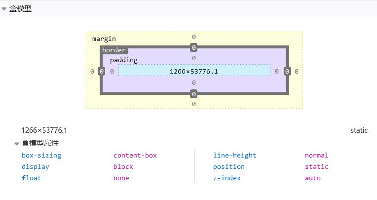
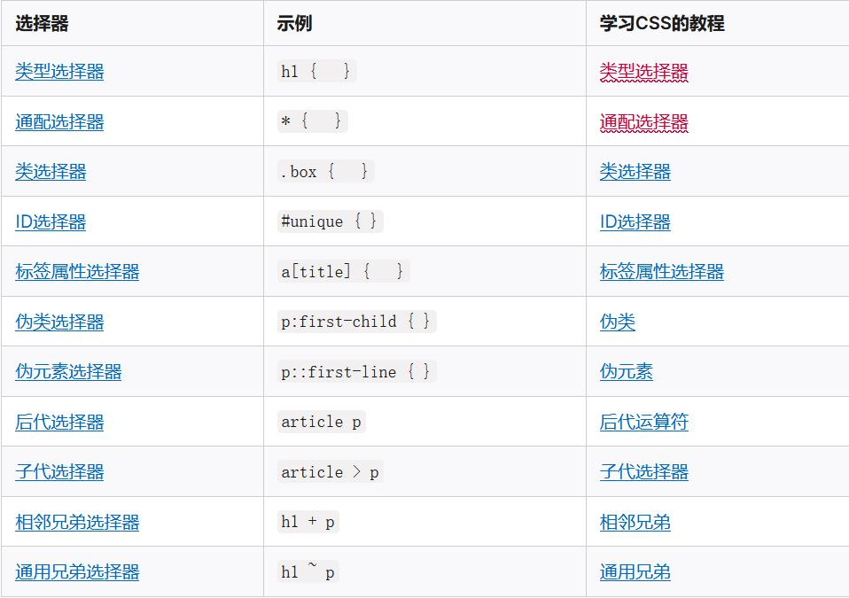

# 盒模型、css 选择器

## 1.盒模型

css3 盒模型分为：**标准盒模型，IE(替代)盒模型**

盒模型**构成**: content(蓝) + padding(紫) + border(灰) + margin(黄)

盒模型**大小**：不包含 margin

盒模型**宽高**：

- 标准盒模型：只包含 content
- IE(替代)盒模型：content + padding + border

可通过 box-sizing 来改变元素的盒模型**类型**：

- box-sizing: content-box ：标准盒模型（默认值）
- box-sizing: border-box ：IE（替代）盒模型




## 2.CSS 选择器和优先级

### 2.1 选择器列表

[选择器列表参考链接](https://developer.mozilla.org/zh-CN/docs/Learn/CSS/Building_blocks/Selectors#选择器参考表)



### 2.2 样式优先级

基本优先级： !important > 内联(就是style) >  id选择器 > 类选择器 > 标签选择器


#### 浏览器优先级计算算法：

设优先级是由 A 、B、C、D 的值来决定的，其中它们的值计算规则如下：
 
> 如果存在`内联样式`，那么 A = 1, 否则 A = 0
> B 的值等于 `ID选择器` 出现的次数
> C 的值等于 `类选择器` 和 `属性选择器` 和 `伪类` 出现的总次数
> D 的值等于 `标签选择器` 和 `伪元素` 出现的总次数 


例如：

```css
html body #nav .selected > a:hover  /* 结果： (0, 1, 2, 3) */
```

计算过程：

1. 没有内联样式  (即 style )，所以 A = 0
2. id 选择器出现 1 次(即 #nav )，所以 B = 1
3. 类选择器出现 1 次(即 .selected )， 伪类选择器出现 1 次 (即 :hover)，属性选择器出现 0 次，所以 C = 2
4. 标签选择器出现 3 次(即 html body a ) 和 伪元素出现 0 次，所以 D = 3

结果是： (0, 1, 2, 3)

#### 如何比较两个优先级的高低

> 1. 从左往右依次进行比较 ，较大者胜出
> 2. 如果相等，则继续往右移动一位进行比较 
> 3. 如果4位全部相等，则后面的会覆盖前面的

例如：

```css
#nav .selected > a:hover            /* 1号 (0, 1, 2, 1) */

html body #nav .selected > a:hover  /* 2号 (0, 1, 2, 3) */

/*比较结果是：2号优先级大于1号*/
```

#### 不同属性样式不能进行优先级比较

对于同属性样式来说，内联样式 + !important 已经是最高优先级， 再写任何外部样式覆盖都将无法生效。
但是对于不同属性样式则不受限制

例如：

```js
<div class="box" style="background: #f00; width: 300px!important;">我的宽度最后是100px<div>

.box {
	max-width: 100px;
}
```

max-width: 100px 可以超越内联的 width: 300px !important
实际上不是优先级的问题，因为**优先级是比较相同属性**的，而 **max-width 和 width 是两个不同的属性**


