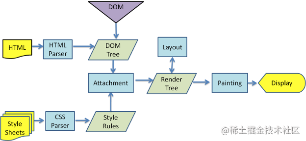
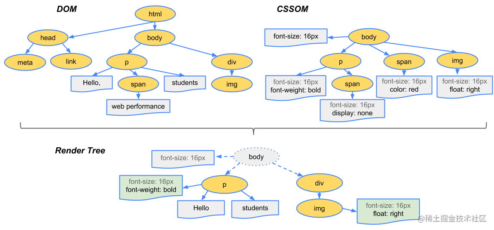

# 重排（reflow）和重绘（repaint）的理解

## 1.何时发生回流、重绘？

**重排（repaint）/回流（reflow）/重构**
当渲染树中的一部分(或全部)因为**元素的规模尺寸，布局，隐藏等改变**而需要重新构建, 这就称为重排（reflow）别称回流(reflow)。

- 添加或删除可见的DOM元素
- 元素的位置发生变化
- 元素的尺寸发生变化（包括外边距、内边框、边框大小、高度和宽度等）
- 内容发生变化，比如文本变化或图片被另一个不同尺寸的图片所替代。
- 页面一开始渲染的时候（这肯定避免不了）
- 浏览器的窗口尺寸变化（因为回流是根据视口的大小来计算元素的位置和大小的）


**重绘（repaint或redraw）**
重绘是指一个元素外观的改变所触发的浏览器行为，浏览器会根据元素的新属性重新绘制，使元素呈现新的外观。重绘发生在元素的可见的外观被改变，但并**没有影响到布局**的时候。

**回流一定会触发重绘，而重绘不一定会回流**

## 2.浏览器渲染过程

step 1. 解析 HTML 生成**DOM树**，解析 CSS 生成 **CSSOM 树**
step 2. 将 DOM 树和 CSSOM 树结合，生成**渲染树**(Render Tree)
step 3. Layout(回流):根据生成的渲染树，进行**回流**(Layout)，得到节点的几何信息（位置，大小）
step 4. Painting (**重绘**):根据渲染树以及回流得到的几何信息，得到节点的绝对像素
step 5. Display:将像素发送给 GPU ， GPU 将多个合成层合并为同一个层，并**展示**在页面中。



其中第二步是**如何生成渲染树**的

1. 从DOM树的根节点开始遍历每个**可见节点**。
2. 对于每个可见的节点，找到CSSOM树中对应的规则，并应用它们。
3. 根据每个可见节点以及其对应的样式，组合生成渲染树。




有一些节点是**不可见节点，不在遍历的范围内，渲染树只包含可见节点**

- 一些不会渲染输出的节点，比如script、meta、link等。
- 一些通过css进行隐藏的节点。比如display:none。

> ps: 利用visibility和opacity隐藏的节点，还是会显示在渲染树上的。只有display:none的节点才不会显示在渲染树上。


## 3.浏览器的优化机制


浏览器会将样式的**修改操作放入到队列里并批量执行来优化回流过程**，直到过了一段时间或者操作达到了一个阈值，才清空队列。但是！当你获取布局信息的操作的时候，会强制队列刷新，比如当你访问以下属性或者使用以下方法：

- offsetTop、offsetLeft、offsetWidth、offsetHeight
- scrollTop、scrollLeft、scrollWidth、scrollHeight
- clientTop、clientLeft、clientWidth、clientHeight
- getComputedStyle()
- getBoundingClientRect

以上属性和方法都需要返回最新的布局信息，因此浏览器不得不清空队列，触发回流重绘来返回正确的值。因此，我们在修改样式的时候，**最好避免使用上面列出的属性，他们都会强制刷新渲染队列**，如果要使用它们，最好将值缓存起来。


## 3.如何减少回流、重绘？

#### 3.1 使用cssText、直接修改元素用的class

```css
/* 示例：使用cssText */
const el = document.getElementById('test');
el.style.cssText += 'border-left: 1px; border-right: 2px; padding: 5px;';
```

```css
/* 示例：修改元素用的class */
const el = document.getElementById('test');
el.className += ' active';
```

#### 3.2 批量操作 DOM 

批量操作 DOM 的步骤

1. 使元素脱离文档流
2. 对其进行多次修改
3. 将元素带回到文档中。


**三种方式可以让DOM脱离文档流**

- 隐藏元素，应用修改，重新显示

- 使用文档片段(document fragment)在当前DOM之外构建一个子树，再把它拷贝回文档。比如使用 **document.createDocumentFragment() 来添加要被添加的节点**，处理完之后再插入到实际 DOM 中

- 将原始元素拷贝到一个脱离文档的节点中，修改节点后，再替换原始的元素。比如使用 **absolute** 或 **fixed** 使元素脱离文档流


