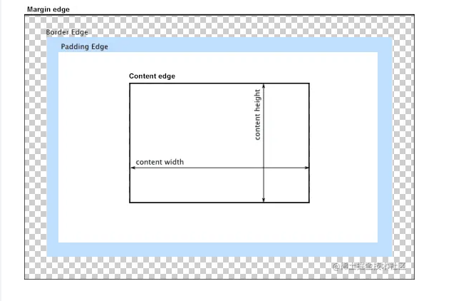
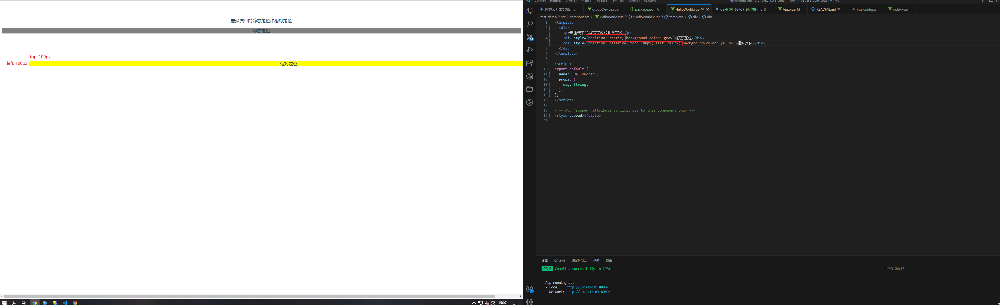

# 对 BFC 的理解

BFC 即 [区块格式化上下文](https://developer.mozilla.org/zh-CN/docs/Web/Guide/CSS/Block_formatting_context)，可以理解为一种特殊环境，决定块级盒的布局及浮动影响范围的区域，并附带多项特性，在理解 BFC 之前需要先对：

- 盒模型
- 块级元素
- 行级元素
- 块级盒
- 行内盒
- 匿名盒
- 定位

进行简单了解

## 盒模型

组成：内容、内边距、边框、外边距



内容区域大小，可以通过 width , min-width , max-width ， height , min-height , max-height 控制，即 css 设置的元素宽高只针对内容区域，不含 margin , border

## 块级元素

css 属性值 display 为 block ， list-item, table 的元素

## 行内级元素

css 属性值 display 为 inline ， inline-block, inline-table 的元素

## 块级盒

块级盒特征：

- css 属性值 display 为 block ， list-item, table 的元素（首先得是块元素）
- 块级盒默认竖直排列
- 每个块级盒都参与 BFC 创建
- 每个块级元素至少生成一个块级盒，称为主会计盒，一些块元素还会生成额外的块级盒，比如 <li> , 用来存放符号


## 行内盒

行内盒特征：

- css 属性值 display 为 inline ， inline-block, inline-table 的元素（首先得是行内元素）
- 行内盒与其他行内元素横向排列为多行
- 所有的可替换元素（即 display 值为 inline，如 `` `<iframe>` `<video>` ` <embed>` 等）生成的盒都是行内盒，会参与 IFC （行内格式化上下文）的创建
- 所有的不可替换行内元素（即 dispaly 值为 inline-block 或 inline-table）生成的盒称为原子行内级盒，不参与 IFC 创建


## 匿名盒

匿名盒指不能被 cs 选择器选中的盒子，如：

```html
<div>
  匿名盒1
  <p>块盒</p>
  匿名盒2
</div>
```


上述代码片段，div 和 p 标签都会生成 2 个块级盒，p 标签前后会生成 2 个匿名盒

匿名盒特征：

- 匿名盒所有可继承的 css 属性都为 inherit
- 匿名盒所有不可继承的 css 属性都为 initial

## 定位方案

- 普通流 （Normal flow）
- 浮动 （Float）
- 定位技术 （Position）

### 普通流

普通流是浏览器默认的 HTML 布局方式，体现在元素检查中就是 ，当 position 为 static 或 relative，且 float 为 none 时，就会触发普通流

普通流特征：

- 普通流中所有盒按各自的默认排序方式，一个接一个排列
- BFC 中，盒子竖向排列
- IFC 中，盒子横向排列
- 静态定位中（ position 为 static ），盒的位置就是普通流中的布局位置
- 相对定位中（ position 为 relative），盒的位置就是普通流中的布局位置，然后依据 top , right , bottom , left 进行指定的偏移（注：即使有偏移，仍然保留原有原有位置。其他普通流不可占用）



### 浮动

- 浮动定位中，盒称为浮动盒（Float Box）
- 盒位于当前行的开头或结尾
- 普通流会环绕在浮动盒周围，除非设置 clear 属性

多个浮动元素，前一个浮动元素位置改变，也会影响后一个浮动元素，如：

浮动元素


浮动元素位置改变


环绕效果


添加 clear 清除浮动


### 定位技术

- 静态定位
- 相对定位
- 绝对定位
- 固定定位

#### 静态定位

position 为 static , 即默认的定位方式，此时元素处于普通流中

#### 相对定位

position 为 relative, 可以通过 top , right , bottom , left 进行偏移量调整（**相对于自身的偏移量**）

#### 绝对定位

**盒会从普通流中移除**, 不影响其他普通流布局

绝对定位特点：

- 元素属性 position 为 absolute 或 fixed 时，是绝对定位
- 绝对定位元素的位置， 可以通过 top , right , bottom , left 进行偏移量调整（**相对于它的包含块的偏移量**）
- 绝对定位为 absolute 的元素，其相对于其最近的一个 relative 、fixed 或 absolute 的父元素（也就是它的包含块中属性为 relative 、fixed 或 absolute 的元素），如果都没有，就相对于 body

#### 固定定位

与绝对定位类似，唯一区别在于其**包含块是浏览器视窗**

## BFC (块级格式化上下文)

BFC 决定块级盒的布局及浮动影响范围的区域

### BFC 的创建

以下元素会创建 BFC

- 根元素 （`<html>`）
- 浮动元素 （ float 不为 none ）
- 绝对定位元素 （ position 为 absolute 或 fixed ）
- 表格的标题和单元格 （ display 为 table-caption , table-cell ）
- 匿名表格单元格元素 （ display 为 table 或 inline-table ）
- 行内块元素 （ display 为 inline-block ）
- overflow 的值不为 visible 的元素
- 弹性元素（ display 为 flex 或 inline-flex 的元素的直接子元素 ）
- 网格元素（ display 为 grid 或 inline-grid 的元素的直接子元素 ）

注：以上是 CSS2.1 规范定义的 BFC 触发方式，在最新的 CSS3 规范中，弹性元素和网格元素会创建 F(Flex)FC 和 G(Grid)FC。

### BFC 范围

> A block formatting context contains everything inside of the element creating it, that is not also inside a descendant element that creates a new block formatting context.

BFC 包含创建它的元素的**所有子元素**，但是不包括创建了新的 BFC 的子元素的内部元素，体现了 BFC 的**隔离**思想

即 子元素如果又创建了一个新的 BFC , 那么新的 BFC 里面的内容就不属于上一个 BFC 了，如： 

```html
<table>
  <tr>
    <td></td>
  </tr>
</table>
```

若 table 元素创建的 BFC 我们记为 BFC_table，tr 元素创建的 BFC 我们记为 BFC_tr, td 元素创建的 BFC 我们记为 BFC_td ，则 2 个 BFC 的范围：

- BFC_td，没有元素，因为 td 没有子元素了
- BFC_tr，只有 td 元素
- BFC_table，只有 tr 元素， 不包括 tr 中的 td 元素

即 一个元素不能同时存在于两个 BFC 中


### BFC 特性

BFC 除了创建隔离空间，还具有以下特性：示例参见每个特性尾部链接
- 1. BFC 内部的块级盒会在垂直方向上一个接一个排列 [demo1](https://codepen.io/lycheelee/pen/BaNYLNO?editors=1100)
- 2. 同一个 BFC 下相邻的块级元素可能发生外边距折叠，创建新的 BFC 可以避免这种外边距折叠  [demo2](https://codepen.io/lycheelee/pen/mdJXrwK?editors=1100)
- 3. 每个元素的 `外边距盒` （ margin box ）的左边 与 `包含块` 的 `块边框盒` （ border box）的左边相对齐 （从左到右格式化的情况），从右到左格式化的情况则相反，即使存在浮动也是如此 [demo3](https://codepen.io/lycheelee/pen/JjdpbGZ?editors=1100)
- 4. 浮动盒的区域不会与 BFC 重叠 [demo4](https://codepen.io/lycheelee/pen/mdJXaXK?editors=1100)
- 5. 计算 BFC 高度时， 浮动元素也会参与计算 [demo5](https://codepen.io/tinasprunt/pen/PoVQyGL?editors=1100)


### BFC 应用

#### 自适应多栏布局

左右栏宽度固定后浮动，中间栏创建 BFC , 由于 盒子的 `外边距盒` （ margin box ）的左边 与 `包含块` 的 `块边框盒` （ border box）的左边相对齐 ，同时浮动盒区域不会和 BFC 重叠 ，所以中间栏自适应 [demo1](https://codepen.io/lycheelee/pen/XWbEjNJ?editors=1100)

#### 防止外边距折叠

创建新的 BFC ，让相邻的块级盒位于不同的 BFC 下，就可以防止外边距折叠 [demo2](https://codepen.io/lycheelee/pen/eYNMdjJ?editors=1100)

#### 清除浮动

BFC 内部的浮动元素也会参与高度计算，可以清除 BFC 内部的浮动 [demo3](https://codepen.io/tinasprunt/pen/eYxVPvg?editors=1100)


## 参考文献：
- https://juejin.cn/post/6960866014384881671
- https://juejin.cn/post/7061588533214969892
- https://developer.mozilla.org/zh-CN/docs/Web/Guide/CSS/Block_formatting_context
- https://blog.csdn.net/ywforever/article/details/125133371
