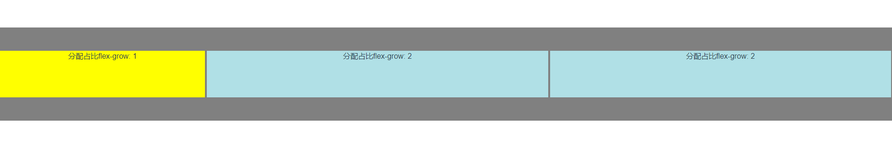
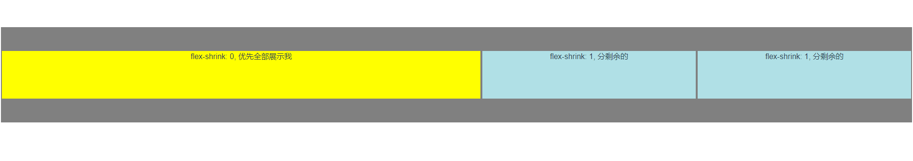
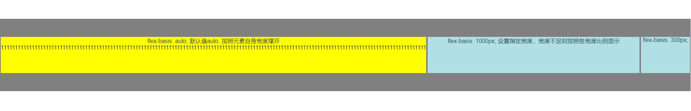

# flex 布局

## 一、基本概念


## 二、容器属性（针对 box）

- flex-direction 轴方向
- flex-wrap 如何换行
- flex-flow 等价于 轴方向+如何换行
- justify-content 主轴对齐方式
- align-items 交叉轴对齐方式
- align-content 多个轴的情况下的轴对齐方式

### 1. flex-direction

```css
.box {
    flex-direction： row | row-reverse | column | column-reverse;
}
```

- row 默认值，主轴为水平方向，从左至右
- row-reverse 主轴为水平方向， 从右至左
- column 主轴为垂直方向，从上至下
- column 主轴为垂直方向，从下至上

### 2. flex-wrap

```css
.box {
  flex-wrap: nowrap | wrap | wrap-reverse;
}
```

- nowrap 默认，不换行


- wrap 换行，第一行在最上


- wrap-reverse 换行，第一行在最下


### 3. flex-flow

```css
.box {
  flex-flow: row nowrap;
}
```

接受 2 个参数，主轴方向、是否换行

### 4. justify-content

```css
.box {
  justify-content: flex-start | flex-end | center | space-between | space-around;
}
```

- flex-start（默认值）：左对齐
- flex-end：右对齐
- center： 居中
- space-between：两端对齐，项目之间的间隔都相等。
- space-around：每个项目两侧的间隔相等。所以，项目之间的间隔比项目与边框的间隔大一倍。


### 5. align-items

```css
.box {
  align-items: flex-start | flex-end | center | baseline | stretch;
}
```

- flex-start：交叉轴的起点对齐。
- flex-end：交叉轴的终点对齐。
- center：交叉轴的中点对齐。
- baseline: 项目的第一行文字的基线对齐。
- stretch（默认值）：如果项目未设置高度或设为 auto，将占满整个容器的高度。


### 6. align-content

```css
.box {
  align-content: flex-start | flex-end | center | space-between | space-around |
    stretch;
}
```

- flex-start：与交叉轴的起点对齐。
- flex-end：与交叉轴的终点对齐。
- center：与交叉轴的中点对齐。
- space-between：与交叉轴两端对齐，轴线之间的间隔平均分布。
- space-around：每根轴线两侧的间隔都相等。所以，轴线之间的间隔比轴线与边框的间隔大一倍。
- stretch（默认值）：轴线占满整个交叉轴。


## 三、项目属性（针对 item）

- order 定义 item 的顺序，越小越靠前。默认为 0
- flex-grow 定义 item 占比
- flex-shrink 定义 item 占比, 默认都为 1，指定为 0 则表示优先保障该 item 全部展示，其余 item 再分剩下的
- flex-basis
- flex 等价于 flex-grow + flex-shrink + flex-basis
- align-self 单个 item 使用单独的对齐方式（可以不与轴对齐方式相同）

### 1. order

定义 item 的顺序，越小越靠前。默认都为 0

```css
.box {
  .item {
    order: <integer>;
  }
}
```


### 2. flex-grow

定义 item 占比, 默认都为 0，按照比例 flex-grow 比例分布



```vue
<template>
  <div id="app">
    <div class="box">
      <div class="item1">分配占比flex-grow: 1;</div>
      <div class="item2">分配占比flex-grow: 2;</div>
      <div class="item2">分配占比flex-grow: 2;</div>
    </div>
  </div>
</template>

<script></script>

<style scoped>
.box {
  width: 100%;
  height: 200px;
  background-color: gray;
  display: flex;
  justify-content: center;
  align-items: center;
}

.item1 {
  height: 100px;
  background-color: yellow;
  border: 2px solid gray;
  flex-grow: 1;
}

.item2 {
  height: 100px;
  background-color: powderblue;
  border: 2px solid gray;
  flex-grow: 2;
}
</style>
```

### 3. flex-shrink

定义 item 占比, 默认都为 1，指定为 0 则表示优先保障该 item 全部展示，其余 item 再分剩下的

如果空间不足，其余 item 按照比例缩小



```vue
<template>
  <div id="app">
    <div class="box">
      <div class="item1">flex-shrink: 0, 优先全部展示我</div>
      <div class="item2">flex-shrink: 1, 分剩余的</div>
      <div class="item2">flex-shrink: 1, 分剩余的</div>
    </div>
  </div>
</template>

<style scoped>
.box {
  width: 100%;
  height: 200px;
  background-color: gray;
  display: flex;
  justify-content: center;
  align-items: center;
}

.item1 {
  width: 1000px;
  height: 100px;
  background-color: yellow;
  border: 2px solid gray;
  flex-shrink: 0;
}

.item2 {
  width: 1000px;
  height: 100px;
  background-color: powderblue;
  border: 2px solid gray;
  flex-shrink: 1;
}
</style>
```

### 4. flex-basis

flex-basis: auto; 默认值 auto, 按照元素自身宽度撑开，flex-basis: 1000px; 设置指定宽度，宽度不足则按照各宽度比例显示



```vue
<template>
  <div id="app">
    <div class="box">
      <div class="item1">
        flex-basis: auto; 默认值auto, 按照元素自身宽度撑开
        <span
          >11111111111111111111111111111111111111111111111111111111111111111111111111111111111111111111111111111111111111111111111111111111111111111111111111111111</span
        >
      </div>
      <div class="item2">
        flex-basis: 1000px; 设置指定宽度，宽度不足则按照各宽度比例显示
      </div>
      <div class="item3">flex-basis: 300px;</div>
    </div>
  </div>
</template>

<style scoped>
.box {
  width: 100%;
  height: 200px;
  background-color: gray;
  display: flex;
  justify-content: center;
  align-items: center;
}

.item1 {
  height: 100px;
  background-color: yellow;
  border: 2px solid gray;
  /* flex-basis: auto; */
}

.item2 {
  height: 100px;
  background-color: powderblue;
  border: 2px solid gray;
  flex-basis: 1300px;
}

.item3 {
  height: 100px;
  background-color: powderblue;
  border: 2px solid gray;
  flex-basis: 300px;
}
</style>
```

### 5. flex

flex 属性是 flex-grow, flex-shrink 和 flex-basis 的简写，默认值为 0 1 auto。

```css
.item {
  flex: none | [ < "flex-grow" > < "flex-shrink" >? || < "flex-basis" >];
}
```

### 6. align-self

align-self 属性允许单个项目有与其他项目不一样的对齐方式，默认值为 auto

```css
.item {
  align-self: auto | flex-start | flex-end | center | baseline | stretch;
}
```


## 四、参考资料及练习地址

- https://www.ruanyifeng.com/blog/2015/07/flex-grammar.html
- https://flexboxfroggy.com/#zh-cn
